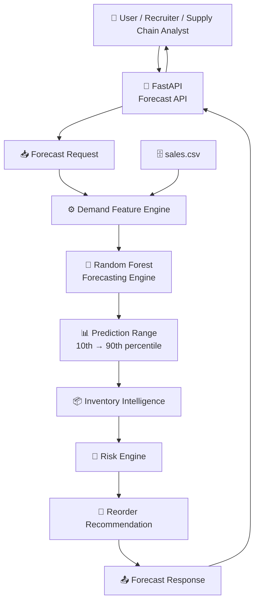
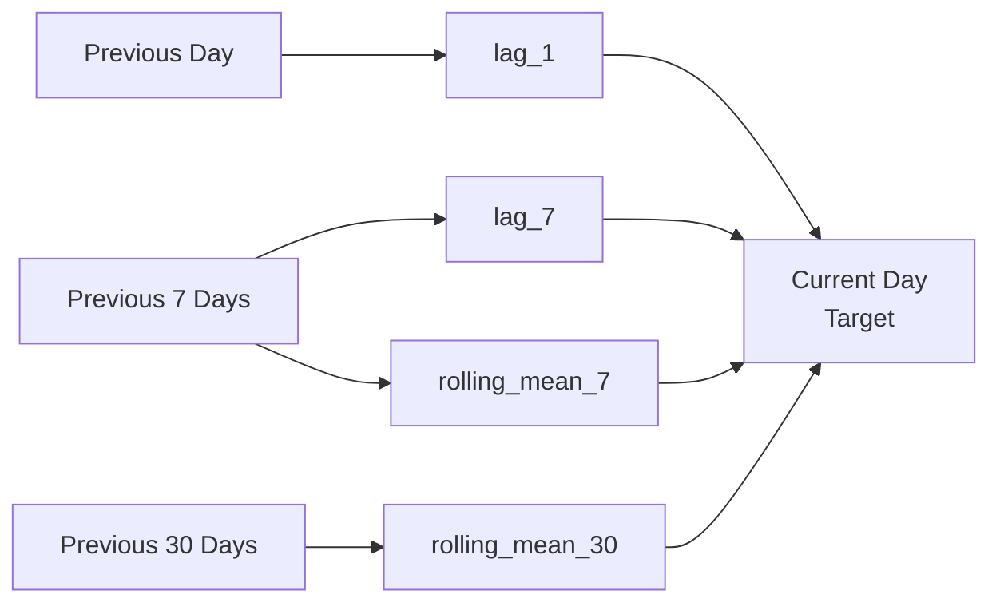
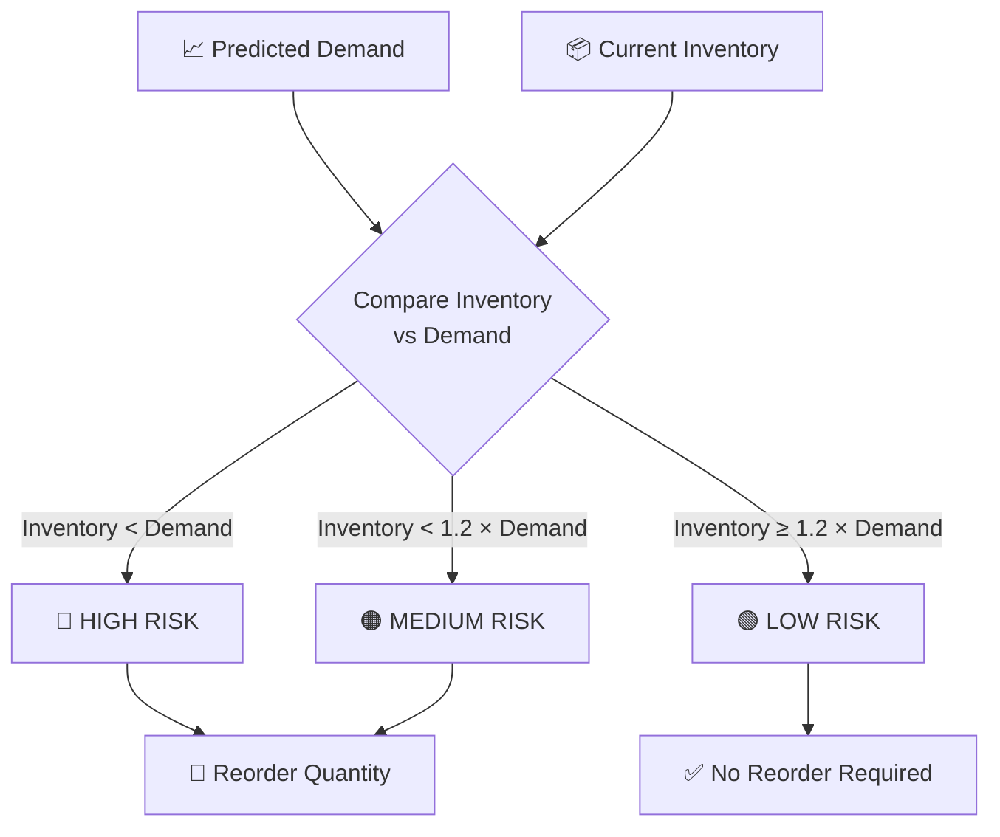
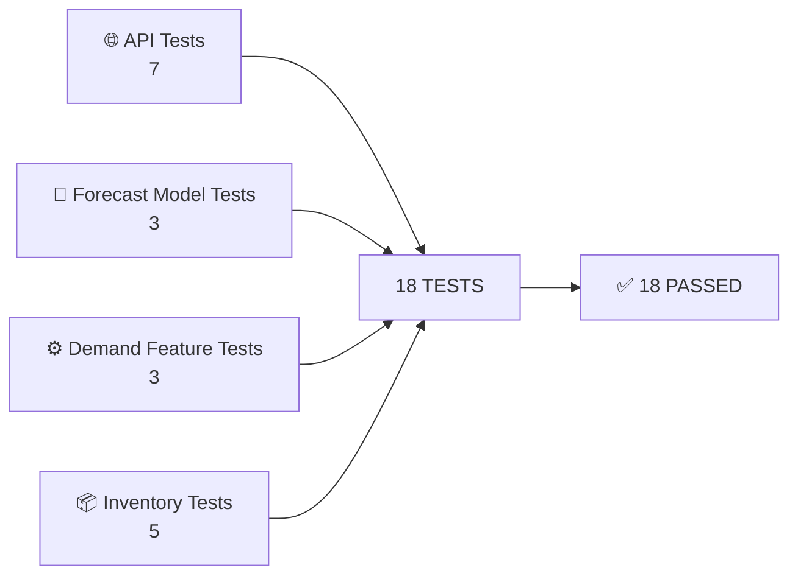
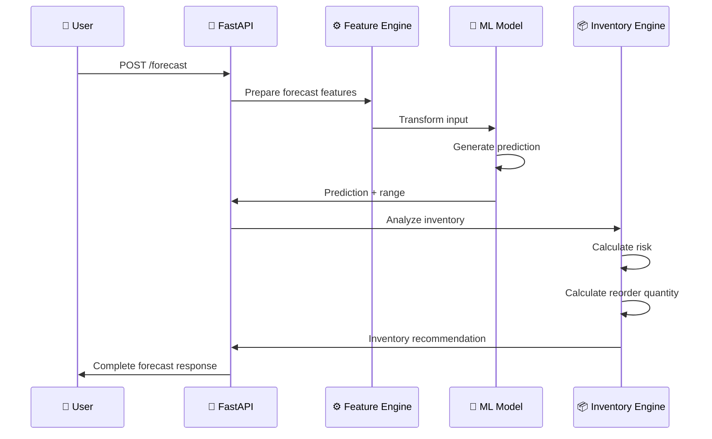

# ⚡ NEXUS Supply Chain Intelligence

<p align="center">


</p>

<p align="center">

<strong>AI-powered demand forecasting + inventory intelligence for modern supply chains.</strong>

<br />

Predict demand. Detect inventory risk. Recommend replenishment.

</p>

---

## 🛰️ SYSTEM STATUS

| Component                  | Status            |
| -------------------------- | ----------------- |
| Demand Feature Engineering | 🟢 Operational    |
| Forecasting Engine         | 🟢 Operational    |
| Random Forest Model        | 🟢 Operational    |
| Forecast Prediction Range  | 🟢 Operational    |
| Inventory Risk Engine      | 🟢 Operational    |
| Reorder Recommendation     | 🟢 Operational    |
| FastAPI Service            | 🟢 Operational    |
| Automated Tests            | 🟢 18 Passed      |
| Git Repository             | 🟢 Clean / Synced |

> **NEXUS** transforms historical sales data into actionable demand and inventory decisions.

---

## 🧠 WHAT IS NEXUS?

NEXUS is an end-to-end supply-chain intelligence platform designed around one central question:

```text
                    "What should we expect to sell,
                     and what should we do about inventory?"
```

Instead of stopping at a machine-learning prediction, NEXUS continues the decision pipeline:


---

# 🏗️ SYSTEM ARCHITECTURE



---

# 🔬 MACHINE LEARNING PIPELINE


---

# 🧩 FEATURE ENGINEERING

NEXUS generates multiple feature groups from historical sales.

### 📅 Calendar Intelligence

```text
day_of_week
day_of_month
month
```

### 💰 Business Intelligence

```text
revenue_per_unit
units_per_customer
```

### 📈 Historical Demand Intelligence

```text
lag_1
lag_7
rolling_mean_7
rolling_mean_30
```

The historical features are designed to avoid target leakage.



> Historical demand information is shifted before rolling calculations so the model does not use the current target value as an input.

---

# 🧠 FORECASTING ENGINE

NEXUS currently uses:

```text
Algorithm      → RandomForestRegressor
Trees          → 200
Random State   → 42
Parallel Jobs  → -1
```

The model receives:

```text
┌──────────────────────────────────────┐
│          FORECAST FEATURES           │
├──────────────────────────────────────┤
│ day_of_week                         │
│ day_of_month                        │
│ month                               │
│ revenue_per_unit                    │
│ units_per_customer                  │
│ lag_1                               │
│ lag_7                               │
│ rolling_mean_7                      │
│ rolling_mean_30                     │
│ product_id                          │
└──────────────────────────────────────┘
                  │
                  ▼
        ┌──────────────────┐
        │ Random Forest    │
        │ 200 Estimators   │
        └──────────────────┘
                  │
                  ▼
        ┌──────────────────┐
        │ Demand Forecast  │
        └──────────────────┘
```

---

# 📊 MODEL PERFORMANCE

Current evaluation:

| Metric           |    Result |
| ---------------- | --------: |
| Training Samples | **5,360** |
| Testing Samples  | **1,340** |
| MAE              |  **4.64** |
| RMSE             |  **6.34** |
| Estimators       |   **200** |

### 🎯 Interpretation

```text
Average Absolute Error
        ↓
       4.64 units

Root Mean Squared Error
        ↓
       6.34 units
```

The model is currently producing a relatively low forecasting error against the generated demand dataset.

---

# 🎯 FORECAST UNCERTAINTY

NEXUS does not return only a single prediction.

Each Random Forest tree generates an individual prediction:

```text
Tree 01 ────────┐
Tree 02 ────────┤
Tree 03 ────────┤
Tree 04 ────────┤
      ...       ├──► Prediction Distribution
Tree 199 ───────┤
Tree 200 ───────┘
```

The system calculates:

```text
Prediction
     │
     ├── Lower Bound → 10th percentile
     │
     └── Upper Bound → 90th percentile
```

This provides an uncertainty range rather than presenting the forecast as an absolute certainty.

---

# 📦 INVENTORY INTELLIGENCE

The forecasting engine feeds directly into the inventory decision engine.



### Risk Logic

```text
IF inventory < predicted demand
        → HIGH

ELSE IF inventory < predicted demand × 1.2
        → MEDIUM

ELSE
        → LOW
```

### Reorder Logic

```text
reorder_quantity =
max(0, predicted_demand - current_inventory)
```

The system guarantees that the recommended reorder quantity can never become negative.

---

# 🚀 FASTAPI SERVICE

NEXUS exposes its forecasting intelligence through a REST API.

## API Endpoints

| Method | Endpoint            | Purpose                              |
| ------ | ------------------- | ------------------------------------ |
| `GET`  | `/`                 | API status                           |
| `GET`  | `/health`           | Health check                         |
| `GET`  | `/inventory/status` | Inventory service status             |
| `POST` | `/forecast`         | Generate demand + inventory forecast |

---

# 📥 FORECAST REQUEST

```json
{
  "product_id": "P005",
  "day_of_week": 2,
  "day_of_month": 15,
  "month": 8,
  "revenue_per_unit": 25.5,
  "units_per_customer": 2.1,
  "lag_1": 21,
  "lag_7": 23,
  "rolling_mean_7": 22,
  "rolling_mean_30": 21.5,
  "current_inventory": 20
}
```

---

# 📤 FORECAST RESPONSE

```json
{
  "product_id": "P005",
  "predicted_units_sold": 22.48,
  "forecast_lower": 20.12,
  "forecast_upper": 24.96,
  "forecast_type": "demand_forecast",
  "model": "Random Forest",
  "inventory_risk": "HIGH",
  "current_inventory": 20,
  "recommended_reorder_quantity": 2
}
```

---

# 🧪 TESTING SYSTEM

NEXUS currently contains **18 automated tests**.



### Test Coverage

| Area              |  Tests |
| ----------------- | -----: |
| Forecast API      |      7 |
| Forecast Model    |      3 |
| Demand Features   |      3 |
| Inventory Service |      5 |
| **Total**         | **18** |

Latest test result:

```text
18 passed
1 warning
0 failures
```

The remaining warning is related to the current `httpx` / Starlette `TestClient` deprecation path and does not cause test failure.

---

# 🗂️ PROJECT STRUCTURE

```text
nexus-supply-chain-intelligence/
│
├── app/
│   ├── __init__.py
│   └── forecast_api.py
│
├── config/
│   ├── __init__.py
│   └── settings.py
│
├── models/
│   ├── __init__.py
│   ├── inventory.py
│   ├── sales.py
│   └── supplier.py
│
├── services/
│   ├── __init__.py
│   ├── data_loader.py
│   ├── demand_analysis.py
│   ├── demand_features.py
│   ├── forecast_model.py
│   ├── generate_dataset.py
│   ├── inventory_service.py
│   └── sales_service.py
│
├── tests/
│   ├── __init__.py
│   ├── test_demand_features.py
│   ├── test_forecast_api.py
│   ├── test_forecast_model.py
│   └── test_inventory_service.py
│
├── data/
│   └── sales.csv
│
├── main.py
├── requirements.txt
└── README.md
```

---

# 🔄 END-TO-END PIPELINE



---

# 🛠️ TECHNOLOGY STACK

```text
┌───────────────────────────────────────────┐
│                NEXUS STACK                │
├───────────────────────────────────────────┤
│ Python                                    │
│ Pandas                                    │
│ Scikit-learn                              │
│ Random Forest                             │
│ FastAPI                                   │
│ Pydantic                                  │
│ Pytest                                    │
│ PowerShell / PyCharm                      │
│ Git / GitHub                              │
└───────────────────────────────────────────┘
```

---

# ⚡ QUICK START

## 1. Clone

```bash
git clone https://github.com/shubhamkardel-ai/nexus-supply-chain-intelligence.git
cd nexus-supply-chain-intelligence
```

## 2. Create virtual environment

```powershell
python -m venv .venv311
```

## 3. Activate

```powershell
.venv311\Scripts\Activate.ps1
```

## 4. Install dependencies

```powershell
pip install -r requirements.txt
```

## 5. Generate dataset

```powershell
python -m services.generate_dataset
```

## 6. Train and evaluate the model

```powershell
python -m services.forecast_model
```

## 7. Run tests

```powershell
pytest -v
```

## 8. Start the API

```powershell
uvicorn app.forecast_api:app --reload
```

---

# 🌐 API WORKFLOW

```text
                 ┌───────────────────┐
                 │     CLIENT        │
                 └─────────┬─────────┘
                           │
                           ▼
                 ┌───────────────────┐
                 │     FASTAPI       │
                 └─────────┬─────────┘
                           │
                           ▼
                 ┌───────────────────┐
                 │ FEATURE ENGINE    │
                 └─────────┬─────────┘
                           │
                           ▼
                 ┌───────────────────┐
                 │ RANDOM FOREST     │
                 └─────────┬─────────┘
                           │
                           ▼
                 ┌───────────────────┐
                 │ DEMAND FORECAST   │
                 └─────────┬─────────┘
                           │
                           ▼
                 ┌───────────────────┐
                 │ INVENTORY RISK    │
                 └─────────┬─────────┘
                           │
                           ▼
                 ┌───────────────────┐
                 │ REORDER ACTION    │
                 └───────────────────┘
```

---

# 📈 CURRENT PROJECT MILESTONE

```text
DATA FOUNDATION              ████████████████████ 100%

FEATURE ENGINEERING          ████████████████████ 100%

FORECASTING MODEL            ████████████████████ 100%

UNCERTAINTY RANGE            ████████████████████ 100%

INVENTORY INTELLIGENCE       ████████████████████ 100%

API LAYER                    ████████████████████ 100%

AUTOMATED TESTING            ████████████████████ 100%

DOCUMENTATION                ████████████████████ 100%

ADVANCED ANALYTICS           ███████░░░░░░░░░░░░░ 35%

PRODUCTION DEPLOYMENT        ██░░░░░░░░░░░░░░░░░░ 10%
```

---

# 🧭 ROADMAP

```mermaid
flowchart LR

    A["✅ Data Pipeline"] --> B["✅ Feature Engineering"]
    B --> C["✅ Forecasting"]
    C --> D["✅ Prediction Range"]
    D --> E["✅ Inventory Intelligence"]
    E --> F["✅ REST API"]
    F --> G["🔜 Dashboard"]
    G --> H["🔜 Database"]
    H --> I["🔜 Model Monitoring"]
    I --> J["🔜 Cloud Deployment"]
```



### Next Engineering Targets

```text
🔜 Interactive supply-chain dashboard

🔜 Persistent database integration

🔜 Historical forecast tracking

🔜 Model performance monitoring

🔜 Automated retraining pipeline

🔜 Supplier intelligence

🔜 Lead-time aware replenishment

🔜 Safety-stock optimization

🔜 Docker deployment

🔜 Cloud deployment
```

---

# 🔐 ENGINEERING PRINCIPLES

NEXUS is being developed around several core principles:

```text
                    ┌──────────────────────┐
                    │     NEXUS CORE       │
                    └──────────┬───────────┘
                               │
          ┌────────────────────┼────────────────────┐
          ▼                    ▼                    ▼
    DATA QUALITY         NO LEAKAGE          TESTABILITY
          │                    │                    │
          └────────────────────┼────────────────────┘
                               │
                               ▼
                       ACTIONABLE OUTPUT
```

### Data Quality

Input data is structured and transformed before entering the model.

### Leakage Prevention

Historical features are shifted so future/target information does not leak into model inputs.

### Testability

Core API, model, feature-engineering, and inventory logic are independently tested.

### Actionability

The system goes beyond prediction by converting demand forecasts into inventory decisions.

---

# 🎯 PROJECT VALUE

NEXUS connects three traditionally separate systems:

```text
       MACHINE LEARNING
              │
              ▼
       DEMAND FORECAST
              │
              ▼
       INVENTORY ANALYSIS
              │
              ▼
       BUSINESS DECISION
```

The goal is not simply:

> "How many units might we sell?"

The goal is:

```text
"What are we likely to sell,
what inventory risk does that create,
and how much should we reorder?"
```

---

# 👨‍💻 DEVELOPMENT

Built as an AI/ML engineering project with a focus on:

```text
Machine Learning
        +
Feature Engineering
        +
Forecasting
        +
Backend API Engineering
        +
Inventory Intelligence
        +
Automated Testing
```

---

# 📜 LICENSE

This project is currently intended for educational, portfolio, and research purposes.

---

<p align="center">

<strong>⚡ NEXUS SUPPLY CHAIN INTELLIGENCE</strong>

<br />

<sub>From historical demand → intelligent forecast → inventory decision.</sub>

</p>
